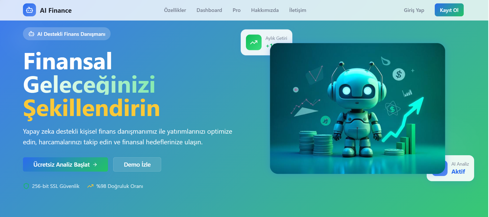
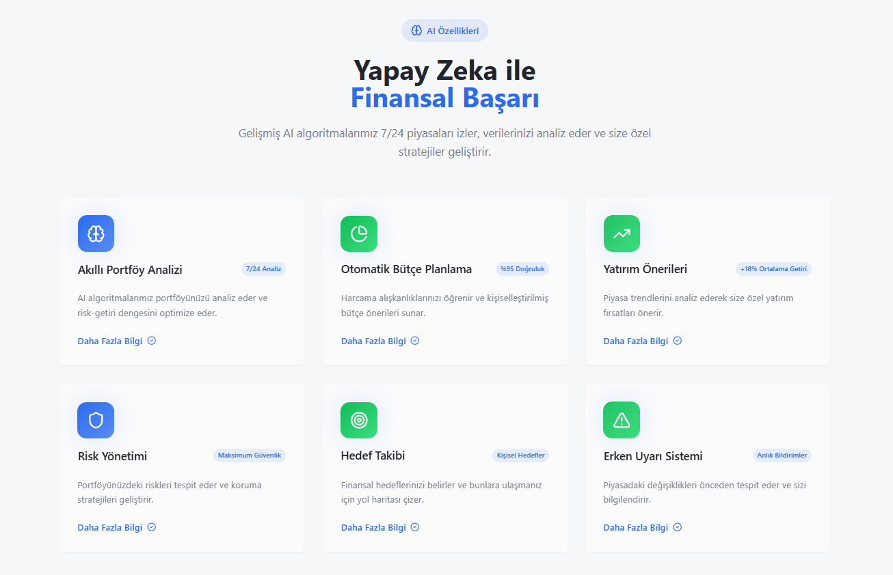
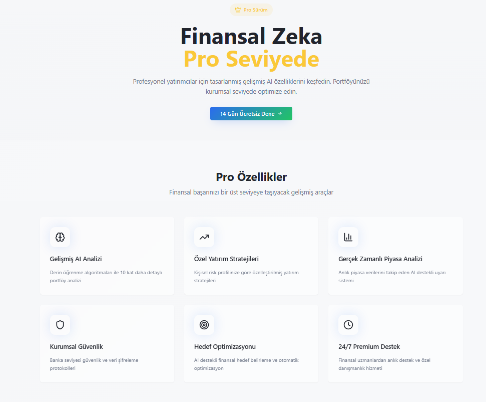
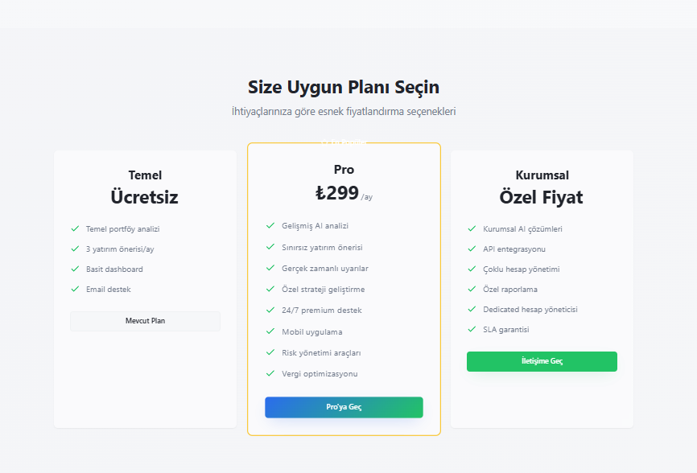
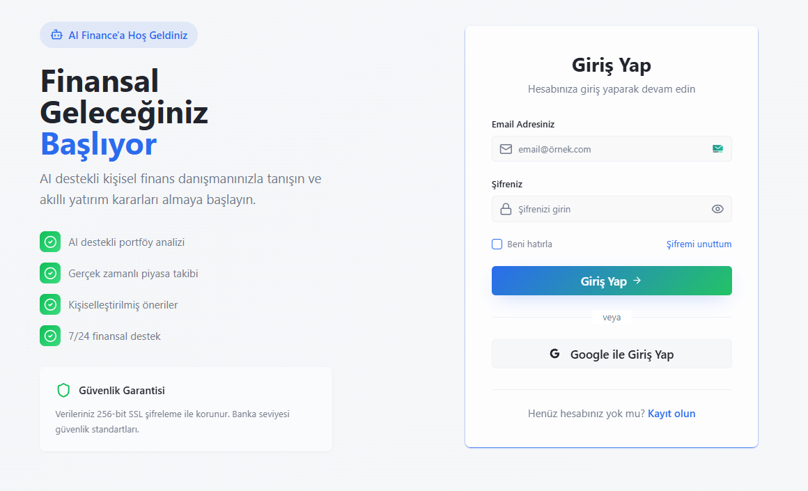
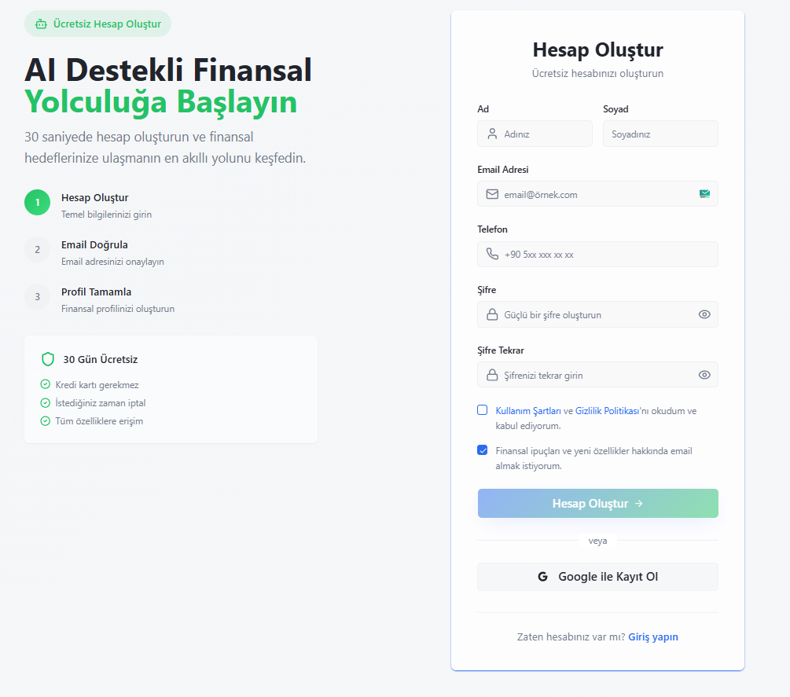

# 🤖 AI Finance - Artificial Intelligence-Powered Financial Advisor

> 💡 A modern, intelligent, and user-friendly financial analysis platform

## 📋 About the Project

**AI Finance** is a web application that uses artificial intelligence technologies to transform personal finance management into a new generation experience. It offers users comprehensive financial advisory services with features such as portfolio analysis, risk management, investment recommendations, and budget planning.

### ✨ Key Features
- 🧠 **Intelligent Portfolio Analysis** - 24/7 portfolio optimization with AI algorithms
- 📊 **Automatic Budget Planning** - Personal budget assistant that learns your spending habits
- 📈 **Investment Advice** - Smart investment advice analyzing market trends
- 🛡️ **Risk Management** - Advanced risk analysis and protection strategies
- 🎯 **Goal Tracking** - Personalized roadmap for financial goals
- ⚠️ **Early Warning System** - Instant market change notifications

### 🔥 Pro Features

- 🚀 **Advanced AI Analysis** - Deep learning algorithms
- 💰 **Real-Time Market Analysis** - Instant data tracking
- 🏆 **Custom Investment Strategies** - Customization based on personal risk profile
- 🔒 **Corporate Security** - Bank-level security protocols
- 📞 **24/7 Premium Support** - Expert financial advice

## 🛠️ Technology Stack

This project was developed using modern web technologies:

- ⚡ **Vite** - Rapid development and build
- 🔷 **TypeScript** - Type-safe development
- ⚛️ **React** - Modern UI library
- 🎨 **Tailwind CSS** - Utility-first CSS framework
- 🎭 **shadcn-ui** - Modern UI components
- 🧭 **React Router** - Client-side routing
- 📊 **Recharts** - Data visualization
- 🔄 **Tanstack Query** - Server state management

## 🖼️ Project Screenshots

### Main Interface


### Features


### Pricing


### Premium Version


### Login


### Register


  
## 🚀 Installation and Development

### Prerequisites

- 📦 Node.js (v18+) - [nvm ile kurulum](https://github.com/nvm-sh/nvm#installing-and-updating)
- 🔧 npm veya yarn package manager

### Local Development

```bash
# 1️⃣ Clone the repository
git clone https://github.com/Can-Ozan/AI-Powered-Personal-Finance-Advisor.git

# 2️⃣ Go to the project directory
cd AI-Powered-Personal-Finance-Advisor

# 3️⃣ Load dependencies
npm install

# 4️⃣ Start the development server
npm run dev
```

🌐 Build ve Deploy
```bash
# Create a production build
npm run build

# Build preview
npm run preview
```

## 📂 Project Structure

```bash
src/
├── 📁 components/         # Reusable UI components
│   ├── 📁 ui/            # shadcn-ui components
│   ├── AIFeatures.tsx    # AI features section
│   ├── Navigation.tsx    # Main navigation
│   └── ...
├── 📁 pages/             # Page components
│   ├── Index.tsx         # Home
│   ├── Pro.tsx           # Pro version page
│   ├── Trial.tsx         # Trial Version
│   └── ...
├── 📁 assets/            # Static files (images, fonts)
├── 📁 hooks/             # Custom React hooks
├── 📁 lib/               # Utility functions
└── 📄 main.tsx           # Application entry point
```

## 📊 Features and Pages

- 🏠 **Home** - Hero section, features, dashboard preview
- 💎 **Pro Page** - Premium features and pricing
- 🆓 **Trial Version** - 3 free AI analyses
- 💳 **Checkout Page** - Secure Pro version purchase
- 📚 **Examples** - Success stories and real results
- ℹ️ **About Us** - Company information and team
- 📞 **Contact** - Support and contact form
- 🔐 **Login/Register** - User authentication

## 🤝 Contribution

1. 🍴 Fork it
2. 🌿 Create a feature branch (`git checkout -b feature/amazing-feature`)
3. 📝 Commit (`git commit -m 'Add amazing feature'`)
4. 📤 Push (`git push origin feature/amazing-feature`)
5. 🔀 Create a Pull Request

## 📜 Licence

This project is licensed under the MIT license.


## 📞 Support

For questions:
- 📧 Email: yusufcanozan9@gmail.com
- 📖 Github: https://github.com/Can-Ozan
---


<p align="center">
  <strong>🚀 Shape your financial future with AI Finance! </strong>
</p>
